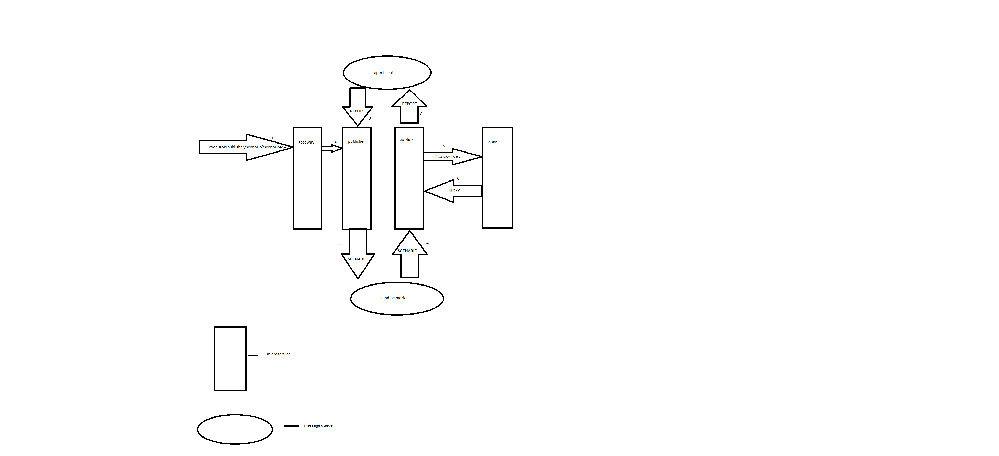

# publisher
This microservice provides an API for working with a queue of reports and scenarios.
The program makes it possible to add scenarios to a scenarios queue or get reports from a reports queue.
[You can also see worker microservice here, which executes scenarios and generates reports.](https://github.com/MorgothGorthaur/worker_microservice)

you can run microservices using docker compose and see additional documentation  [here](https://github.com/victortarasov1/executor-service-docker-compose),
 and change the microservice's configuration [here](https://github.com/victortarasov1/executor-service-configuration)

## Flow

### the scenario execution and generating reports flow:



## Publisher's API

- `PUT: /executor/publisher/scenario` - add new scenario
- `DELETE: /executor/publisher/scenario/?scenarioId=` - delete scenario by id
- `PATCH: /executor/publisher/scenario` - update scenario
- `POST: /executor/publisher/scenario/?scenarioId=` - execute scenario by id
- `GET: /executor/publisher/scenario/?scenarioId=` - get scenario by id
- `GET: /executor/publisher/scenario/all` - get all scenarios
- `GET: /executor/publisher/reports/?scenarioId=` - get report by id
- `GET: /executor/publisher/reports/all` - get all reports

## JSON Examples


### Scenario Example

```json
 {
  "id": "6c933798-722b-4539-8544-5f9bb2fefc9f",
  "name": "linux scenario",
  "site": "https://kernel.org/",
  "steps": [
    {
      "id": "9d24893f-37d4-4f53-b7fa-0852516d39da",
      "action": "sleep",
      "value": "5000:8000",
      "createdAt": "2024-07-03T15:02:59.752771Z"
    },
    {
      "id": "cb437fb8-2069-46bc-9f87-1f1e72545f03",
      "action": "clickCss",
      "value": "#banner > nav > ulwww > li:nth-child(1) > a",
      "createdAt": "2024-07-03T15:02:59.754714Z"
    },
    {
      "id": "2a431e78-e8a6-4721-a006-d871b0226d0d",
      "action": "sleep",
      "value": "3000:5000",
      "createdAt": "2024-07-03T15:02:59.756483Z"
    },
    {
      "id": "ecfaa716-9204-4c44-8968-a922e7598544",
      "action": "clickXpath",
      "value": "/html/body/footer/address[2]/a[4]",
      "createdAt": "2024-07-03T15:02:59.758472Z"
    },
    {
      "id": "1630dce4-c8e2-4d9b-90d9-766b47e5599c",
      "action": "sleep",
      "value": "3000:5000",
      "createdAt": "2024-07-03T15:02:59.760070Z"
    }
  ],
  "createdAt": "2024-07-03T15:02:59.690204Z"
}
```

### Report Example
```json
 {
        "id": "0c7bf91b-9185-4ba8-9677-5d7718de003a",
        "scenarioId": "6c933798-722b-4539-8544-5f9bb2fefc9f",
        "startTime": "2024-07-03T15:03:51.33485",
        "endTime": "2024-07-03T15:03:53.226406",
        "errorMessage": "Failed to perform 'Sleep' step.",
        "webDriverInfo": "RemoteWebDriver: chrome on linux (ae6058186077e5f81c3495d248d0e5de)",
        "name": "linux scenario",
        "site": "https://kernel.org/",
        "stepReports": [
            {
                "id": "e46c11b3-f81a-4f8f-b5a6-46e162002b1a",
                "startTime": "15:03:53.223",
                "endTime": "15:03:53.226",
                "errorMessage": "Failed to perform 'Sleep' step.",
                "action": "sleep",
                "value": "8000:5000"
            }
        ]
    }
```


## Used Technologies
### Back-end:
- Spring Web
- Spring Data JPA
- Spring Actuator
- Spring Cloud Config
- Spring Cloud Eureka
- Spring Cloud Circuit breaker
- Spring Cloud Stream
- AspectJ
- AssertJ
- Jakarta Validation
- postgresql
- Mockito
### Server build:
- gradle
- google jib

## Requirements
- java 17
- gradle